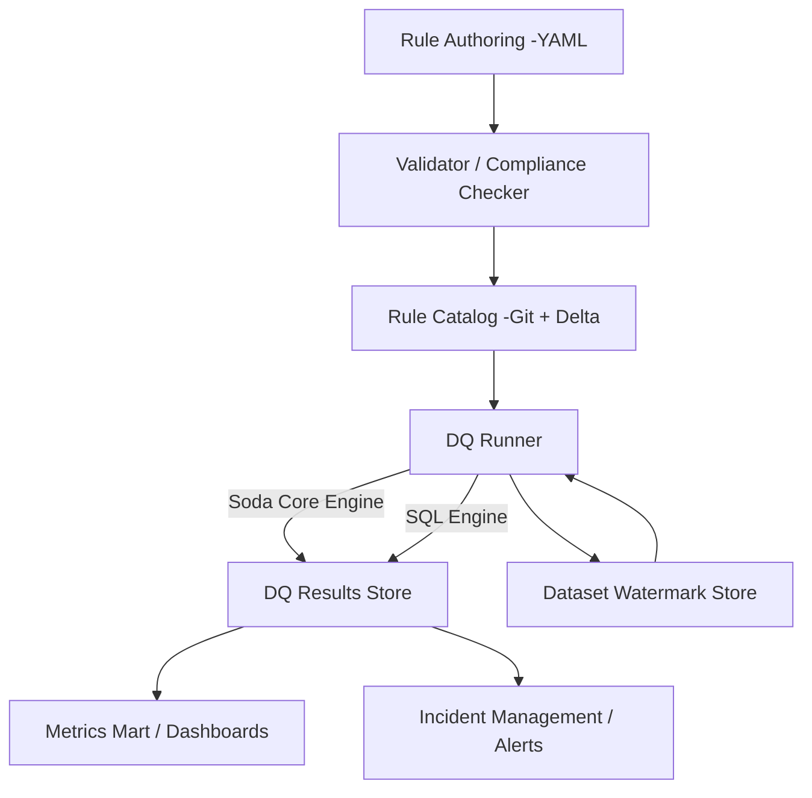
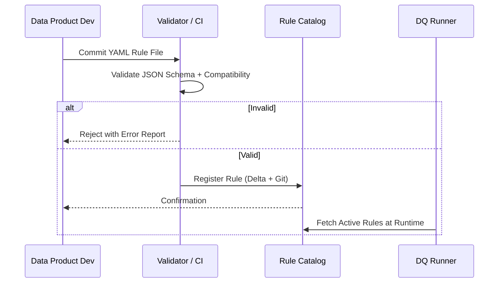
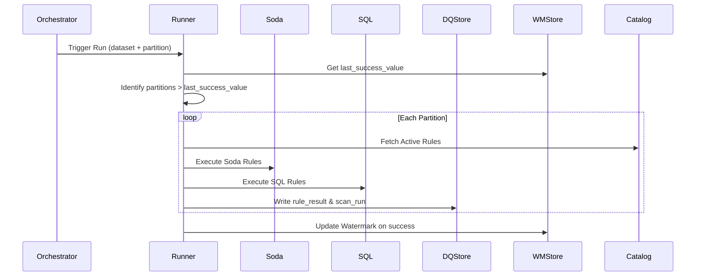

# Data Quality Accelerator — Design Document

## 1. Overview
The **Data Quality Accelerator (DQA)** provides a standardized and extensible framework to define, execute, and monitor data quality (DQ) rules within data pipelines. It ensures **trustworthy data delivery** across domains and data products while being lightweight and pipeline-friendly.

### Goals
- Deliver *trustworthy data* to business users.
- Allow *multi-granular* quality metrics — domain, data product, dataset, date, and rule.
- Enable *automated execution* of rules as part of data pipelines.
- Persist *DQ metrics and outcomes* for observability and compliance.
- Support *incremental/HWM execution* for scalable DQ operations.

### Out of Scope (Phase-1)
- Natural language authoring.
- UI-based rule definition.

---

## 2. Architecture Overview



### Core Components
| Component | Description |
|------------|-------------|
| **Rule Authoring (YAML)** | Declarative rule definition per dataset. |
| **Validator / Compliance Checker** | Enforces schema, compatibility, and completeness of rules. |
| **Rule Catalog** | Central repository for rule YAMLs and metadata. |
| **DQ Runner** | Executes rules using Soda Core or SQL engine; supports HWM/incremental scans. |
| **DQ Results Store** | Stores granular DQ results, measurements, and run metadata. |
| **Dataset Watermark Store** | Tracks last successful partitions for incremental runs. |
| **Metrics Mart** | Aggregated facts and dimensions for slicing, trending, and visualization. |

---

## 3. Rule Taxonomy

| Category | Description |
|-----------|-------------|
| Accuracy | Correctness of data values vs. source/truth. |
| Completeness | Ensures mandatory fields or records are not missing. |
| Consistency | Checks alignment across datasets/sources. |
| Conformity | Ensures values follow expected formats or enumerations. |
| Uniqueness | Detects duplicate keys or rows. |
| Freshness | Ensures data is updated within SLA windows. |
| Validity | Checks for domain-specific constraints and value ranges. |
| Integrity | Referential or relationship correctness. |
| Anomaly | Detects unusual patterns or statistical deviations. |

---

## 4. Rule Definition Template (YAML)

```yaml
dataset: silver.payments
product: Payments
domain: Trading
owner: payments_dp@company.com
partitions:
  by: event_date
  format: yyyy-MM-dd
defaults:
  severity: high
  engine: soda
  run_policy: soft_fail
rules:
  - id: payments.amount.non_negative.v01
    dq_category: validity
    dq_check_type: value_range
    engine: soda
    columns: [amount]
    params:
      operator: ">="
      operand: 0
    sla:
      target_pass_rate: 99.5
      window_days: 7
```

---

## 5. Validation Flow (Compliance Checker)



---

## 6. Execution Flow (DQ Runner)



---

## 7. Repository Layouts

### dq-accelerator/
```
dq-accelerator/
├── runner/
│   ├── dq_runner.py
│   ├── engines/
│   │   ├── soda_engine.py
│   │   └── sql_engine.py
│   └── compliance_checker.py
├── rulespec/
│   └── dq_rule_schema.json
├── ddl/
│   ├── dq_results.sql
│   └── dq_metrics_mart.sql
├── utils/
│   ├── watermark_manager.py
│   └── notifier.py
├── examples/
│   ├── payments_rules.yaml
│   └── sample_config.yaml
└── Makefile
```

### dp-payments/
```
dp-payments/
├── pipelines/
│   ├── silver_payments_job.py
│   └── dq_task.py
├── rules/
│   └── silver_payments.yaml
├── configs/
│   └── dq_config.yaml
└── notebooks/
    └── dq_results_analysis.ipynb
```

---

## 8. Roadmap

| Phase | Deliverables |
|--------|--------------|
| **Phase-1** | YAML rule definition, schema validator, runner (Soda + SQL), incremental runs |
| **Phase-2** | DQ metrics mart, dashboards, CI validator integration |
| **Phase-3** | NL rule compiler, rule governance UI, domain onboarding templates |
