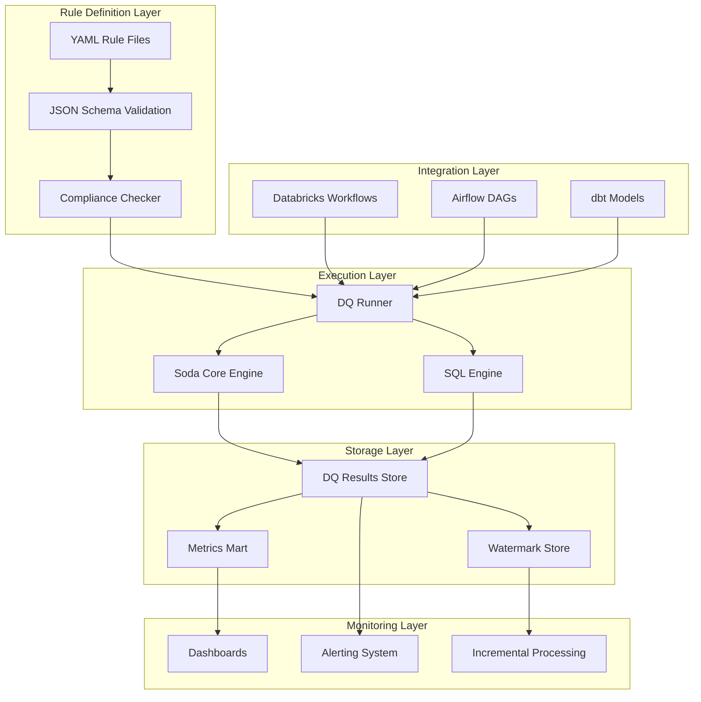
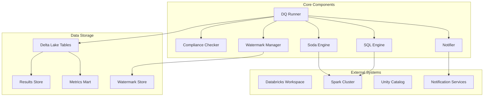
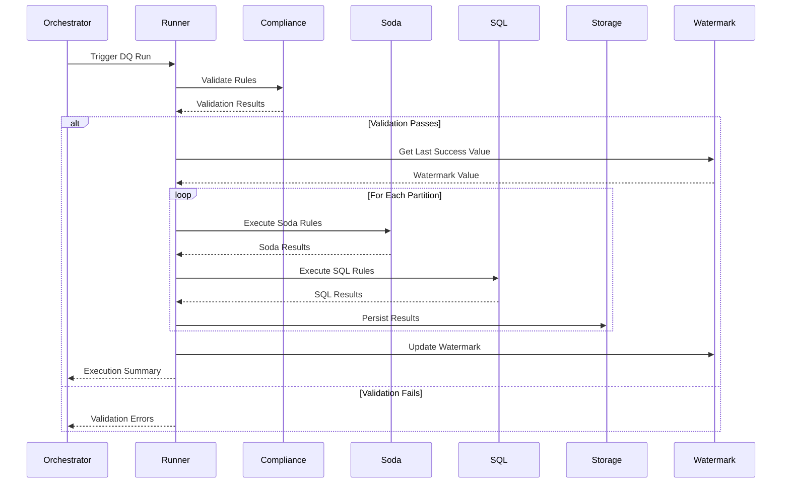
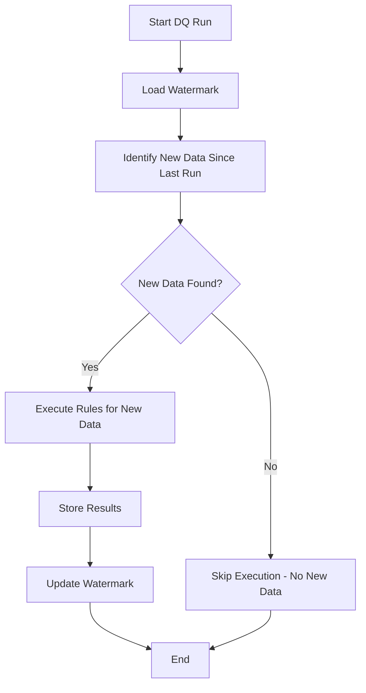
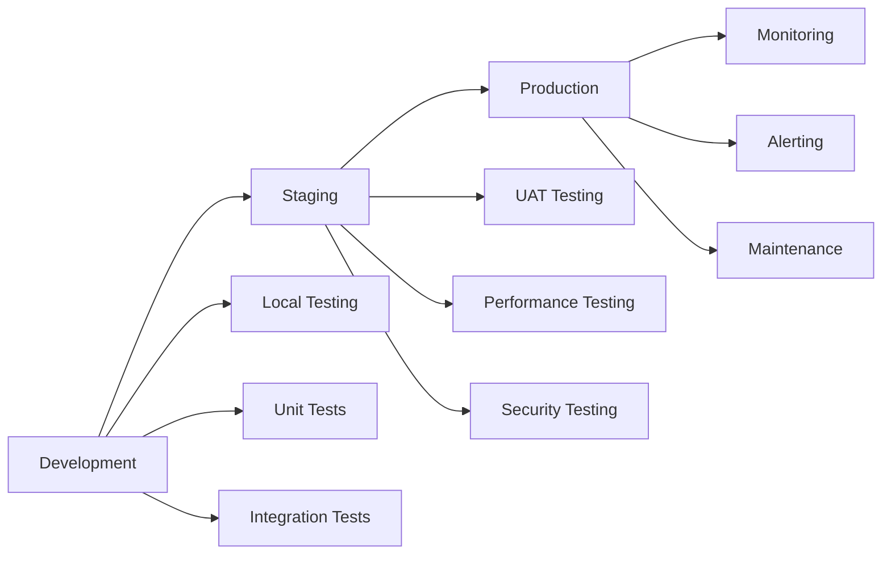

# Data Quality Accelerator - Architecture

## 1. Overview

The **Data Quality Accelerator (DQA)** is a comprehensive, enterprise-grade framework designed to define, execute, and monitor data quality rules within Databricks environments. It provides a standardized approach to ensuring data trustworthiness across domains and data products while maintaining high performance and scalability.

### Implementation Status

| Component | Status | Implementation Level | Notes |
|-----------|--------|---------------------|-------|
| **Core Framework** | ✅ Complete | Production Ready | DQRunner (Databricks-optimized), ComplianceChecker, Data Models |
| **Watermark Management** | ✅ Complete | Production Ready | Delta Lake integration, CRUD operations |
| **Schema Validation** | ✅ Complete | Production Ready | JSON Schema validation, business rules |
| **Soda Engine** | ✅ Complete | Production Ready | Real Soda Core integration, simplified for Databricks |
| **SQL Engine** | ✅ Complete | Production Ready | Real Spark SQL integration, simplified for Databricks |
| **Incremental Processing** | ✅ Complete | Production Ready | WatermarkManager fully integrated with DQRunner |
| **Databricks Integration** | ✅ Complete | Production Ready | Workflow integration, job automation |
| **Metrics Mart** | ✅ Complete | Production Ready | SQL DDL and population logic implemented |
| **Repository Structure** | ✅ Complete | Production Ready | Databricks-optimized structure (jobs, libraries, notebooks, sql) |
| **Multi-Engine Support** | ✅ Complete | Production Ready | Framework supports multiple engines |

### Core Principles

- **Declarative Configuration**: YAML-based rule definition with JSON Schema validation
- **Multi-Engine Execution**: Support for Soda Core and custom SQL engines
- **Incremental Processing**: High Water Mark (HWM) based execution for scalability
- **Enterprise Integration**: Seamless integration with Databricks Workflows, Airflow, and dbt
- **Comprehensive Monitoring**: Detailed execution results and metrics collection
- **Type Safety**: Full type hints and Pydantic models for robust data handling

### Current Implementation Details

#### ✅ **Completed Components**

**1. Core Framework (Production Ready)**
- **DQRunner**: Databricks-optimized execution engine with comprehensive error handling
- **ComplianceChecker**: JSON schema validation and business rule validation
- **Data Models**: Pydantic models for type safety (DQResult, DQRunSummary, WatermarkRecord)
- **Repository Structure**: Databricks-optimized structure (jobs, libraries, notebooks, sql)

**2. Watermark Management (Production Ready)**
- **WatermarkManager**: Delta Lake-based watermark storage with CRUD operations
- **WatermarkRecord**: Type-safe watermark data model
- **Schema**: Optimized watermark table with proper indexing
- **Features**: Automatic table creation, error handling, comprehensive logging

**3. Schema Validation (Production Ready)**
- **JSON Schema**: Comprehensive rule validation schema
- **Business Rules**: Category validation, engine-specific rule validation
- **Examples**: Complete payments rules example with multiple rule types

**4. Execution Engines (Production Ready)**
- **Soda Engine**: Real Soda Core integration, simplified for Databricks environments
- **SQL Engine**: Real Spark SQL integration, simplified for Databricks environments
- **No Availability Checks**: Engines assume dependencies are available (Databricks runtime)

**5. Databricks Integration (Production Ready)**
- **Workflow Management**: Complete Databricks workflow integration
- **Job Automation**: Automated job creation and scheduling
- **Entry Points**: Simplified job entry points for Databricks execution

#### 🎯 **Key Design Decisions**

**1. Databricks-First Approach**
- **Simplified Engines**: No availability checks, assumes Databricks runtime provides dependencies
- **Global Spark**: Assumes `spark` is available globally in Databricks environment
- **Optimized Structure**: Repository structure optimized for Databricks best practices

**2. Production-Ready Architecture**
- **Real Engine Integration**: Soda Core and Spark SQL engines with actual functionality
- **Complete Workflow**: End-to-end processing from rule definition to metrics
- **Enterprise Features**: Comprehensive error handling, logging, and monitoring

### Repository Structure

The project follows Databricks best practices with the following structure:

```
src/
├── jobs/                          # Databricks job definitions
│   ├── databricks_job_entries.py  # Job entry points
│   └── databricks_jobs.py         # Job definitions
├── libraries/                     # Reusable code modules
│   ├── dq_runner/                 # DQ execution engine
│   ├── utils/                     # Utility modules
│   ├── validation/                # CI/CD validation
│   └── integrations/              # External integrations
├── notebooks/                     # Databricks notebooks
├── sql/                          # SQL scripts
└── schemas/                      # Schemas and examples
```

## 2. System Architecture

### High-Level Architecture



### Component Architecture



## 3. Data Flow Architecture

### Rule Execution Flow



### Incremental Processing Flow



## 4. Data Quality Categories

### Comprehensive DQ Taxonomy

| Category | Description | Check Types | Use Cases |
|----------|-------------|-------------|-----------|
| **Accuracy** | Correctness of data values against source/truth | `accuracy_check`, `cross_validation`, `reference_check` | Financial data validation, master data verification |
| **Completeness** | Ensures mandatory fields are not missing | `not_null`, `not_empty`, `completeness`, `required_fields` | Customer data completeness, transaction records |
| **Consistency** | Alignment across datasets and sources | `cross_table`, `referential_integrity`, `format_consistency` | Multi-source data alignment, cross-system validation |
| **Conformity** | Values follow expected formats/enumerations | `format_check`, `standard_compliance`, `enum_check` | Data format standardization, regulatory compliance |
| **Uniqueness** | No duplicate keys or rows | `uniqueness`, `primary_key`, `unique_key`, `duplicate_check` | Primary key validation, duplicate detection |
| **Freshness** | Data updated within SLA windows | `freshness_lag`, `freshness_check`, `staleness_check` | Real-time data monitoring, SLA compliance |
| **Validity** | Domain-specific constraints and ranges | `value_range`, `regex_match`, `data_type`, `constraint_check` | Business rule validation, data type enforcement |
| **Integrity** | Referential and relationship correctness | `foreign_key`, `referential_integrity`, `fk_exists` | Relational data integrity, cross-table validation |
| **Anomaly** | Unusual patterns and statistical deviations | `statistical_anomaly`, `outlier_detection`, `pattern_anomaly` | Fraud detection, data drift monitoring |

## 5. Rule Definition Schema

### YAML Structure

```yaml
# Dataset-level configuration
dataset: silver.payments  # Resolved to catalog.schema.table based on environment
product: Payments
domain: Trading
owner: payments_dp@company.com

# Partitioning configuration
partitions:
  by: event_date
  format: yyyy-MM-dd

# Default settings
defaults:
  severity: high
  engine: soda
  run_policy: soft_fail

# Individual rules
rules:
  - id: payments.amount.non_negative.v01
    dq_category: validity
    dq_check_type: value_range
    engine: soda
    columns: [amount]
    params:
      operator: ">="
      operand: 0
    sla:
      target_pass_rate: 99.5
      window_days: 7
    sampling:
      mode: none
```

### Environment-Aware Configuration

The framework supports environment-aware table resolution:

```yaml
# Environment configuration (config/dev.yaml)
catalog: dev_catalog
default_schema: silver
table_prefix: dev_

# Environment configuration (config/prod.yaml)  
catalog: main
default_schema: silver
table_prefix: ""
```

**Table Name Resolution:**
- `silver.payments` → `dev_catalog.silver.payments` (dev)
- `silver.payments` → `main.silver.payments` (prod)
- `payments` → `main.silver.payments` (prod with default schema)

### Rule ID Convention

Rules follow a hierarchical naming convention:
```
{domain}.{table}.{column}.{check_type}.{version}
```

Examples:
- `payments.amount.non_negative.v01`
- `customers.email.valid_format.v02`
- `transactions.pk.unique.v01`

## 6. Storage Architecture

### Delta Lake Tables

#### DQ Results Store

| Attribute | Data Type | Description |
|-----------|-----------|-------------|
| `run_id` | STRING | Unique identifier for each DQ run execution |
| `rule_id` | STRING | Unique identifier for the DQ rule (e.g., payments.amount.non_negative.v01) |
| `dataset` | STRING | Dataset name being validated (e.g., silver.payments) |
| `partition_value` | STRING | Value of the partition column for this execution |
| `engine` | STRING | Execution engine used (soda, sql) |
| `pass_flag` | BOOLEAN | Whether the rule passed (true) or failed (false) |
| `execution_time_ms` | BIGINT | Rule execution time in milliseconds |
| `started_ts` | TIMESTAMP | When the rule execution started |
| `ended_ts` | TIMESTAMP | When the rule execution completed |
| `error_message` | STRING | Error details if rule execution failed |
| `measurements` | MAP<STRING, STRING> | Key-value pairs of measured values (e.g., row_count, null_count) |
| `metadata` | MAP<STRING, STRING> | Additional metadata for the rule execution |

```sql
CREATE TABLE dq_results (
  run_id STRING,
  rule_id STRING,
  dataset STRING,
  partition_value STRING,
  engine STRING,
  pass_flag BOOLEAN,
  execution_time_ms BIGINT,
  started_ts TIMESTAMP,
  ended_ts TIMESTAMP,
  error_message STRING,
  measurements MAP<STRING, STRING>,
  metadata MAP<STRING, STRING>
) USING DELTA
PARTITIONED BY (dataset, partition_value)
```

#### Metrics Mart

| Attribute | Data Type | Description |
|-----------|-----------|-------------|
| `dataset` | STRING | Dataset name for which metrics are calculated |
| `partition_value` | STRING | Partition value for which metrics are calculated |
| `run_date` | DATE | Date when the DQ run was executed |
| `total_rules` | BIGINT | Total number of rules executed for this dataset/partition |
| `passed_rules` | BIGINT | Number of rules that passed validation |
| `failed_rules` | BIGINT | Number of rules that failed validation |
| `pass_rate` | DOUBLE | Percentage of rules that passed (passed_rules / total_rules * 100) |
| `avg_execution_time_ms` | DOUBLE | Average execution time across all rules in milliseconds |
| `critical_failures` | BIGINT | Number of critical severity rule failures |
| `high_severity_failures` | BIGINT | Number of high severity rule failures |

```sql
CREATE TABLE dq_metrics_mart (
  dataset STRING,
  partition_value STRING,
  run_date DATE,
  total_rules BIGINT,
  passed_rules BIGINT,
  failed_rules BIGINT,
  pass_rate DOUBLE,
  avg_execution_time_ms DOUBLE,
  critical_failures BIGINT,
  high_severity_failures BIGINT
) USING DELTA
PARTITIONED BY (run_date)
```

#### Watermark Store

| Attribute | Data Type | Description |
|-----------|-----------|-------------|
| `dataset` | STRING | Dataset name (e.g., silver.payments) |
| `watermark_column` | STRING | Column used for incremental processing (e.g., event_date, batch_id) |
| `watermark_value` | STRING | Last successfully processed value of the watermark column |
| `dq_run_completed_ts` | TIMESTAMP | Timestamp when the DQ run completed successfully |
| `updated_ts` | TIMESTAMP | Timestamp when this watermark record was last updated |

```sql
CREATE TABLE dq_watermarks (
  dataset STRING NOT NULL COMMENT 'Dataset name (e.g., silver.payments)',
  watermark_column STRING NOT NULL COMMENT 'Column used for incremental processing (e.g., event_date, batch_id)',
  watermark_value STRING NOT NULL COMMENT 'Last successfully processed value of the watermark column',
  dq_run_completed_ts TIMESTAMP NOT NULL COMMENT 'Timestamp when the DQ run completed successfully',
  updated_ts TIMESTAMP NOT NULL COMMENT 'Timestamp when this watermark record was last updated'
) USING DELTA
COMMENT 'High water marks for incremental data quality processing';

-- Index for efficient lookups
CREATE INDEX idx_dq_watermarks_dataset ON dq_watermarks (dataset);
```

The watermark store is managed by the `WatermarkManager` class, which provides:
- **Automatic table creation**: Creates the watermark table if it doesn't exist
- **CRUD operations**: Get, set, update, and delete watermarks
- **Type safety**: Uses Pydantic models for data validation
- **Error handling**: Comprehensive error handling and logging
- **Delta Lake integration**: Leverages Delta Lake for ACID transactions and time travel

## 7. Watermark Management

### WatermarkManager Class

The `WatermarkManager` is a core component that manages high water marks for incremental data processing. It provides a robust, type-safe interface for tracking the last successfully processed partition value for each dataset.

#### Key Features

- **Delta Lake Integration**: Uses Delta Lake tables for ACID transactions and time travel
- **Automatic Table Management**: Creates watermark tables automatically if they don't exist
- **Type Safety**: Uses Pydantic models (`WatermarkRecord`) for data validation
- **Comprehensive CRUD Operations**: Full create, read, update, delete functionality
- **Error Handling**: Robust error handling with detailed logging
- **Performance Optimization**: Indexed lookups for efficient dataset queries

#### Usage Example

```python
from pyspark.sql import SparkSession
from src.utils.watermark_manager import WatermarkManager

# Initialize Spark session
spark = SparkSession.builder \
    .appName("DQProcessing") \
    .config("spark.sql.extensions", "io.delta.sql.DeltaSparkSessionExtension") \
    .getOrCreate()

# Initialize WatermarkManager
watermark_manager = WatermarkManager(
    spark=spark,
    watermark_table_path="/path/to/dq_watermarks"
)

# Get current watermark
watermark = watermark_manager.get_watermark("silver.payments")
if watermark:
    last_processed = watermark.watermark_value
    print(f"Last processed watermark: {last_processed}")

# Update watermark after successful processing
watermark_manager.set_watermark(
    dataset="silver.payments",
    watermark_column="event_date",
    watermark_value="2025-01-16",
    dq_run_completed_ts=datetime.utcnow()
)
```

#### WatermarkRecord Model

```python
class WatermarkRecord:
    dataset: str                    # Dataset name (e.g., "silver.payments")
    watermark_column: str          # Column used for watermarking (e.g., "event_date", "batch_id")
    watermark_value: str           # Last processed watermark value
    dq_run_completed_ts: datetime  # When DQ run completed successfully
    updated_ts: datetime          # When record was updated
```

#### Incremental Processing Workflow

1. **Get Current Watermark**: Retrieve the last successfully processed partition
2. **Identify New Partitions**: Query source data to find partitions newer than watermark
3. **Process New Partitions**: Execute DQ rules for each new partition
4. **Update Watermark**: Update watermark after successful processing
5. **Handle Failures**: Maintain watermark integrity on processing failures

## 8. Execution Engines

### Soda Core Engine

The Soda Core engine provides:
- **Declarative Checks**: YAML-based rule definition
- **Built-in Metrics**: Comprehensive data quality measurements
- **Performance Optimization**: Efficient Spark-based execution
- **Extensibility**: Custom checks and validations

```python
class SodaEngine:
    def run(self, dataset: str, rules: List[Dict], partition: str) -> Tuple[List[Dict], str, int]:
        # Generate Soda scan YAML
        # Execute Soda Core scan
        # Parse and return results
```

### SQL Engine

The SQL engine provides:
- **Custom SQL Queries**: Full SQL flexibility for complex validations
- **Cross-Table Validation**: Multi-table and cross-dataset checks
- **Performance Tuning**: Optimized SQL execution
- **Integration**: Seamless integration with existing SQL workflows

```python
class SqlEngine:
    def run(self, rules: List[Dict], partition: str) -> Tuple[List[Dict], int]:
        # Execute SQL rules
        # Parse results
        # Return standardized format
```

## 8. Integration Patterns

### Databricks Workflows Integration

```python
# In Databricks Workflow
from src.libraries.dq_runner.databricks_runner import DQRunner

def run_dq_checks():
    runner = DQRunner()
    summary = runner.run_incremental(
        rule_path="rules/payments.yaml",  # File-based loading
        dataset="silver.payments",
        watermark_column="event_date",
        environment="prod"  # Environment-aware catalog resolution
    )
    return summary.dict()

# Or with folder-based rule loading
def run_dq_checks_folder():
    runner = DQRunner()
    summary = runner.run_incremental(
        rule_path="rules/domain_rules/",  # Folder-based loading
        dataset="silver.payments", 
        watermark_column="event_date",
        environment="prod"
    )
    return summary.dict()
```

### Airflow Integration

```python
# In Airflow DAG
from airflow import DAG
from airflow.operators.python import PythonOperator
from src.libraries.dq_runner.databricks_runner import DQRunner

def run_dq_task(**context):
    runner = DQRunner()
    summary = runner.run_incremental(
        rule_path="rules/payments.yaml",  # File or folder path
        dataset=context["params"]["dataset"],
        watermark_column=context["params"]["watermark_column"],
        environment=context["params"].get("environment", "prod")
    )
    
    if summary.failed_rules > 0:
        raise AirflowException(f"DQ check failed: {summary.failed_rules} rules failed")
    
    return summary.dict()

dq_task = PythonOperator(
    task_id="run_dq_checks",
    python_callable=run_dq_task,
    dag=dag
)
```

### dbt Integration

```sql
-- In dbt model
{{ config(materialized='table') }}

WITH dq_results AS (
  SELECT *
  FROM {{ ref('dq_results') }}
  WHERE dataset = 'silver.payments'
    AND partition_value = '{{ var("partition_value") }}'
)

SELECT 
  rule_id,
  pass_flag,
  execution_time_ms,
  error_message
FROM dq_results
WHERE pass_flag = false
```

## 9. Monitoring and Observability

### Metrics Collection

The framework collects comprehensive metrics:

- **Execution Metrics**: Run duration, rule execution times, success rates
- **Data Quality Metrics**: Pass/fail rates, violation counts, data volumes
- **System Metrics**: Resource utilization, performance bottlenecks
- **Business Metrics**: SLA compliance, data freshness, anomaly detection

### Alerting Strategy

```yaml
# Alerting configuration
alerts:
  critical_failure:
    condition: "failed_rules > 0 AND severity = 'critical'"
    channels: ["slack", "email", "pagerduty"]
  
  sla_breach:
    condition: "pass_rate < target_pass_rate"
    channels: ["slack", "email"]
  
  performance_degradation:
    condition: "execution_time_ms > threshold"
    channels: ["slack"]
```

### Dashboard Metrics

Key metrics for monitoring dashboards with their data sources:

| Metric Category | Metric Name | Description | Primary Data Source | Supporting Tables |
|----------------|-------------|-------------|-------------------|-------------------|
| **DQ Health Score** | Overall Health Score | Weighted average of all dataset health scores | `dq_metrics_mart` | `dq_results`, `dq_watermarks` |
| | Dataset Health Score | Pass rate and failure severity for each dataset | `dq_metrics_mart` | `dq_results` |
| | Critical Issues Count | Number of critical severity failures | `dq_metrics_mart` | `dq_results` |
| **Rule Performance** | Rule Execution Time | Average execution time per rule | `dq_results` | `dq_metrics_mart` |
| | Rule Success Rate | Percentage of successful rule executions | `dq_results` | `dq_metrics_mart` |
| | Engine Performance | Performance comparison between Soda and SQL engines | `dq_results` | `dq_metrics_mart` |
| **Trend Analysis** | Daily Pass Rate Trend | Pass rate trends over time | `dq_metrics_mart` | `dq_results` |
| | Rule Failure Trends | Failure patterns and frequency | `dq_results` | `dq_metrics_mart` |
| | Data Volume Trends | Processing volume trends | `dq_results` | `dq_watermarks` |
| **SLA Compliance** | SLA Breach Count | Number of SLA violations | `dq_metrics_mart` | `dq_results` |
| | SLA Compliance Rate | Percentage of SLA adherence | `dq_metrics_mart` | `dq_results` |
| | Critical SLA Breaches | Critical severity SLA violations | `dq_results` | `dq_metrics_mart` |
| **Anomaly Detection** | Data Drift Detection | Unusual data patterns and distributions | `dq_results` | `dq_metrics_mart` |
| | Performance Anomalies | Unusual execution time patterns | `dq_results` | `dq_metrics_mart` |
| | Volume Anomalies | Unusual data volume patterns | `dq_results` | `dq_watermarks` |
| **Operational Metrics** | Processing Latency | Time from data arrival to DQ completion | `dq_watermarks` | `dq_results` |
| | Data Freshness | Time since last successful DQ run | `dq_watermarks` | `dq_results` |
| | Incremental Efficiency | Percentage of data processed incrementally | `dq_watermarks` | `dq_results` |
| **Business Impact** | Data Quality Score | Business-weighted quality score | `dq_metrics_mart` | `dq_results` |
| | Downstream Impact | Impact on dependent systems | `dq_results` | `dq_metrics_mart` |
| | Cost of Poor Quality | Estimated cost of data quality issues | `dq_results` | `dq_metrics_mart` |

#### Metric Calculation Examples

**DQ Health Score Calculation:**
```sql
-- Overall Health Score (0-100)
SELECT 
  AVG(pass_rate) * 100 as overall_health_score
FROM dq_metrics_mart 
WHERE run_date >= CURRENT_DATE - 7;
```

**Rule Performance Analysis:**
```sql
-- Rule execution time trends
SELECT 
  rule_id,
  AVG(execution_time_ms) as avg_execution_time,
  PERCENTILE_CONT(0.95) WITHIN GROUP (ORDER BY execution_time_ms) as p95_execution_time
FROM dq_results 
WHERE started_ts >= CURRENT_DATE - 30
GROUP BY rule_id;
```

**SLA Compliance Monitoring:**
```sql
-- SLA breach detection
SELECT 
  dataset,
  COUNT(*) as total_rules,
  SUM(CASE WHEN pass_flag = false THEN 1 ELSE 0 END) as failed_rules,
  (SUM(CASE WHEN pass_flag = false THEN 1 ELSE 0 END) * 100.0 / COUNT(*)) as failure_rate
FROM dq_results 
WHERE started_ts >= CURRENT_DATE - 1
GROUP BY dataset
HAVING (SUM(CASE WHEN pass_flag = false THEN 1 ELSE 0 END) * 100.0 / COUNT(*)) > 5.0;
```

## 10. Performance Optimization

### Spark Optimization

- **Partition Pruning**: Leverage Delta Lake partitioning for efficient data access
- **Predicate Pushdown**: Push filters to data sources
- **Column Pruning**: Select only required columns
- **Broadcast Joins**: Use broadcast joins for small lookup tables
- **Data Skipping**: Utilize Delta Lake data skipping capabilities

### Incremental Processing

- **High Water Mark**: Track last successful partition for incremental runs
- **Partition-based Processing**: Process only new or changed partitions
- **Efficient Watermark Updates**: Atomic watermark updates for consistency
- **Parallel Processing**: Execute rules in parallel across partitions

### Resource Management

- **Cluster Sizing**: Right-size clusters based on workload requirements
- **Memory Optimization**: Optimize Spark memory settings
- **Garbage Collection**: Tune GC settings for long-running processes
- **Caching Strategy**: Cache frequently accessed data with appropriate storage levels

## 11. Security and Compliance

### Data Security

- **Encryption**: Encrypt sensitive data at rest and in transit
- **Access Control**: Use Unity Catalog for fine-grained access control
- **Data Masking**: Mask sensitive data in logs and test environments
- **Audit Logging**: Comprehensive audit trail for all operations

### Compliance Features

- **Data Lineage**: Track data flow and transformations
- **Retention Policies**: Automated data retention and cleanup
- **Regulatory Compliance**: Support for GDPR, SOX, and other regulations
- **Audit Reports**: Generate compliance reports and documentation

## 12. Scalability and Extensibility

### Horizontal Scaling

- **Multi-cluster Support**: Distribute workloads across multiple clusters
- **Load Balancing**: Balance rule execution across available resources
- **Auto-scaling**: Automatic cluster scaling based on workload
- **Resource Isolation**: Isolate different workloads and environments

### Extensibility Points

- **Custom Engines**: Add new execution engines for specialized use cases
- **Custom Checks**: Implement domain-specific validation logic
- **Plugin Architecture**: Extensible plugin system for custom functionality
- **API Integration**: RESTful APIs for external system integration

## 13. Deployment Architecture

### Environment Promotion



### CI/CD Pipeline

1. **Code Commit**: Developers commit changes to feature branches
2. **Automated Testing**: Run unit, integration, and e2e tests
3. **Code Quality**: Execute linting, type checking, and security scans
4. **Build**: Create deployment artifacts
5. **Deploy**: Deploy to target environment
6. **Validation**: Run smoke tests and validation checks
7. **Monitoring**: Set up monitoring and alerting

## 14. Future Roadmap

### Phase 1 (Current)
- ✅ YAML rule definition with JSON Schema validation
- ✅ Multi-engine execution (Soda Core + SQL)
- ✅ Incremental processing with HWM
- ✅ Comprehensive compliance checking
- ✅ Enterprise integration patterns

### Phase 2 (Next 6 months)
- 🔄 DQ metrics mart and dashboards
- 🔄 CI/CD integration and automated validation
- 🔄 Advanced alerting and notification system
- 🔄 Performance optimization and monitoring
- 🔄 Documentation and training materials

### Phase 3 (Future)
- 🔮 Natural language rule authoring
- 🔮 Rule governance UI and management
- 🔮 Domain-specific onboarding templates
- 🔮 Advanced analytics and ML integration
- 🔮 Multi-cloud and hybrid deployment support

## 15. Best Practices

### Rule Design

- **Single Responsibility**: Each rule should validate one specific aspect
- **Clear Naming**: Use descriptive rule IDs and check types
- **Appropriate Severity**: Set severity levels based on business impact
- **SLA Definition**: Define clear SLAs and thresholds
- **Documentation**: Document business context and rationale

### Performance

- **Partition Strategy**: Design partitioning for efficient data access
- **Rule Optimization**: Optimize rules for performance and cost
- **Resource Management**: Right-size resources for workload requirements
- **Monitoring**: Monitor performance and optimize based on metrics

### Maintenance

- **Version Control**: Use semantic versioning for rule changes
- **Testing**: Comprehensive testing of rule changes
- **Documentation**: Keep documentation current and comprehensive
- **Monitoring**: Proactive monitoring and alerting

---

*This architecture document is maintained alongside the codebase and reflects the current state of the Data Quality Accelerator framework.*
